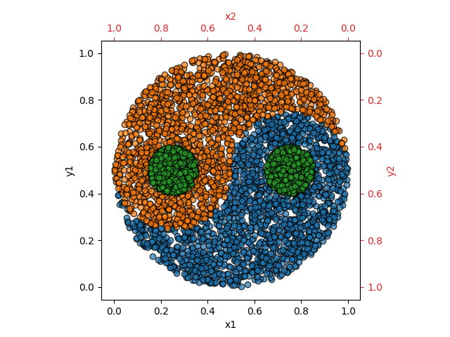

# Yin-Yang Dataset

This deep learning dataset was developed for research on biologically plausible error-backpropagation and deep learning in spiking neural networks.
It serves as an alternative to e.g. the MNIST dataset providing the following advantages:
- **Very clear gap between the accuracies reached by a linear classifier/shallow network and a deep neural network**
- Smaller and therefore faster to train
- Symmetric input design allows successful training of neuron models without intrinsic bias

For more information see:

The Yin-Yang dataset; *L. Kriener, J. Göltz, M. A. Petrovici*; https://arxiv.org/abs/2102.08211

## Structure

As shown in the image below each data sample consists of 4 values `(x1, y1, x2, y2)` where `x2` and `y2` are generated by a mirrored axis. This symmetry is helpful when training neuron models without intrinsic bias. 

Each data sample is classified into one of the three classes `yin` (blue), `yang` (orange) and `dot` (green). All classes have approximately the same amount of samples.


### Data generation
In order to produce a balanced dataset, the data is generated with rejection sampling:
- draw random integer between 0 and 2, this is the desired class `c` of the next sample that will be generated
- draw `x1` and `y1` value and calculate the corresponding `x2` and `y2` 
- check if the drawn sample is of class `c`
  - if yes: keep sample
  - if no: draw new `x1` and `y1` and check again
- repeat until chosen number of samples are produced

The equations for the calclulation of the Yin-Yang shape are inspired by: https://link.springer.com/content/pdf/10.1007/11564126_19.pdf (Appendix A).

## Usage
This dataset is designed to make use of the PyTorch dataset and dataloader architecture, but (with some minor changes) it can also be used in any other deep learning framework.

#### PyTorch
A detailed example is shown in `example.ipynb`.

Initializing the dataset:
```python
from dataset import YinYangDataset

dataset_train = YinYangDataset(size=5000, seed=42)
dataset_validation = YinYangDataset(size=1000, seed=41)
dataset_test = YinYangDataset(size=1000, seed=40)
```
**Note:** It is very important to give different seeds for trainings-, validation- and test set, as the data is generated randomly using rejection sampling. Therefore giving the same seed value will result in having the same samples in the different datasets!

Setting up PyTorch Dataloaders:
```python
from torch.utils.data import DataLoader

batchsize_train = 20
batchsize_eval = len(dataset_test)

train_loader = DataLoader(dataset_train, batch_size=batchsize_train, shuffle=True)
val_loader = DataLoader(dataset_validation, batch_size=batchsize_eval, shuffle=True)
test_loader = DataLoader(dataset_test, batch_size=batchsize_eval, shuffle=False)
```

#### Other deep learning frameworks
Even though this dataset is designed for PyTorch, the following easy code changes make it useable in any deep learning framework:
- In `dataset.py` delete line 2
```python
from torch.utils.data.dataset import Dataset
```
- and replace in line 5
```python
class YinYangDataset(Dataset):
```
by
```python
class YinYangDataset(object):
```
The dataset can now be loaded as shown above. The data can be iterated over, saved to file or imported in other frameworks.

## Reference results

These references are generated with the same settings for network layout and training (hidden layer of 120 neurons for the ANN, batchsize of 20, learning rate of 0.001, adam optimizer, 300 epochs for the ANN as well as the shallow network) as in `example.ipynb`. The training was repeated 20 times with randomly chosen weight initializations. The accuracies are given as mean and standard devaition over the 20 runs.

| Network           | Test accuracy [%] | Train accuracy [%] |
| ------------------|:-----------------:|:------------------:|
| ANN (4-120-3)     | 98.7 +- 0.3       | 98.5 +- 0.3        |
| Shallow network   | 64.3 +- 0.2       | 64.8 +- 0.2        |

## Usage in publications

Up until now this dataset has been used in the following publications:
- Fast and deep: energy-efficient neuromorphic learning with first-spike times; *J. Göltz∗, L. Kriener∗, A. Baumbach, S. Billaudelle, O. Breitwieser, B. Cramer, D. Dold, A. F. Kungl, W. Senn, J. Schemmel, K. Meier, M. A. Petrovici*; https://arxiv.org/abs/1912.11443
- EventProp: Backpropagation for Exact Gradients in Spiking Neural Networks; *T. Wunderlich and C. Pehle*; https://arxiv.org/abs/2009.08378

If you would like to use this dataset in a publication feel free to do so and please contact me so that this list can be updated.

The data used in the publication "Fast and deep: energy-efficient neuromorphic learning with first-spike times" is also uploaded as `.npy` files in `publication_data/`.
